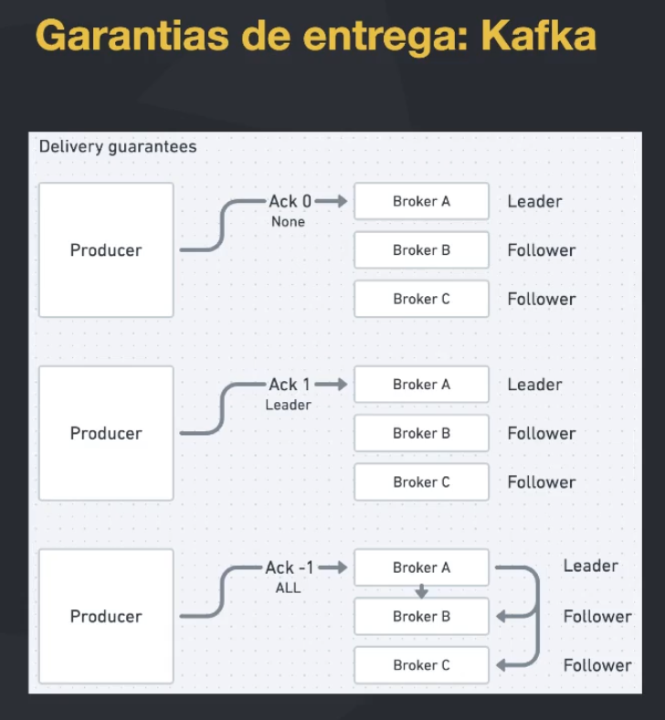

## Resiliência

### Garantia entrega com Retry

- jitter

### Garantia de entrega com Kafka

- Broker é um sistema que armazena uma mensagem para um outro sistema ler essa mensagem depois.

- Cluster é um conjunto de blockers

- _Leader é quem realmente recebe a mensagem_

#### Ack 0

- Não envia nenhum confirmação de recebimento
- É o mais rápido

#### Ack 1

- retorna a confirmação de recebimento antes de replicar a mensagem
- caso fique indisponível logo após acusar o recebimento, o sistema ficar descoberto

#### Ack -1 ou Ack All

- Antes de retornar que recebe, manda a mensagem para todos os blockers
- certeza que mesmo que um blocker quebre, todos tem a mensagem

_Para mais velocidade:_ Ack 0
_Para moderado:_ Ack 1
_Para mais seguro:_ Ack -1

#### Situações mais complexas

- O que acontece se o message broker cair?
