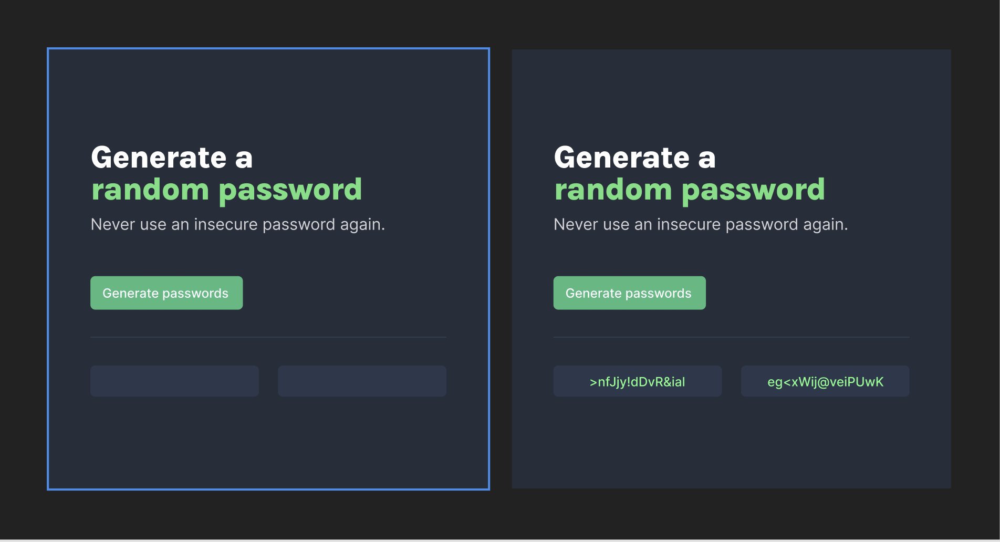
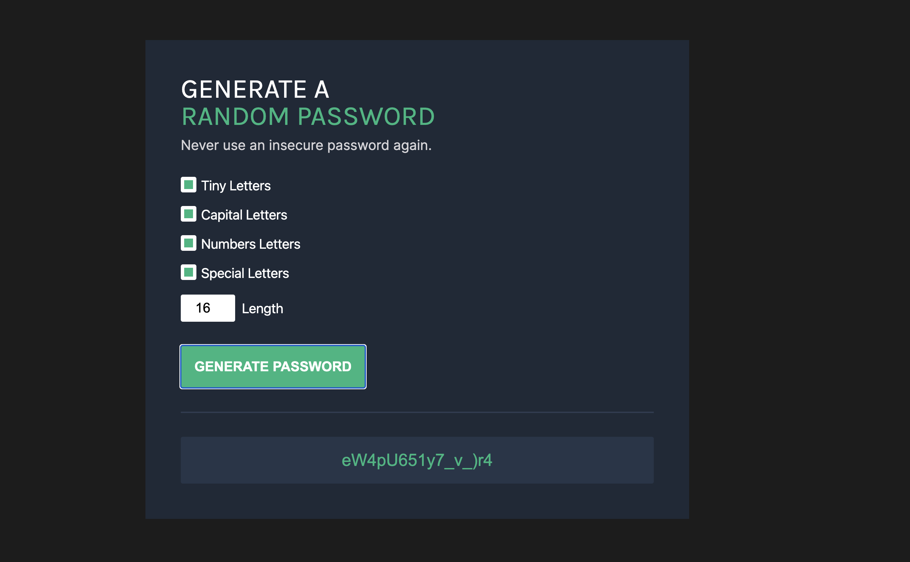

## Day 2: Password Generator

**Note:** This repository is part of a personal project called [my-studies-journal](https://github.com/carloscsc/my-studies-journal). The goal is to organize the code, study materials, and personal projects I use daily. For more details, please visit the main page of the repository.

[[SEE IN ACTION]](https://my-study-journal.vercel.app/day2-password-generator)

This project is part of the "Learn JavaScript" course available on [Scrimba](https://v2.scrimba.com/). The objective was to create a password generator that produces a random password.

The initial project was very simple and required the app to return a basic numeric password, as shown in the screenshot below from the [project's Figma file](<https://www.figma.com/design/NEj9JDycMjF3XKXq7swoc9/Random-Password-Generator-(New-version)?m=auto&t=FGJfu55xMJxfjfzN-6>):

I decided to add some extra features, such as the ability to choose the password length and whether it should contain special characters, letters, and/or numbers. This made the project more challenging and useful.

This is the result

This project was particularly interesting for learning and practicing specific JavaScript functionalities such as arrays, objects, loops, functions, DOM manipulation, and random number generation.

As this project is very basic and recommended for beginners, I made sure to create extensive documentation to help those who are just starting to study JavaScript.
