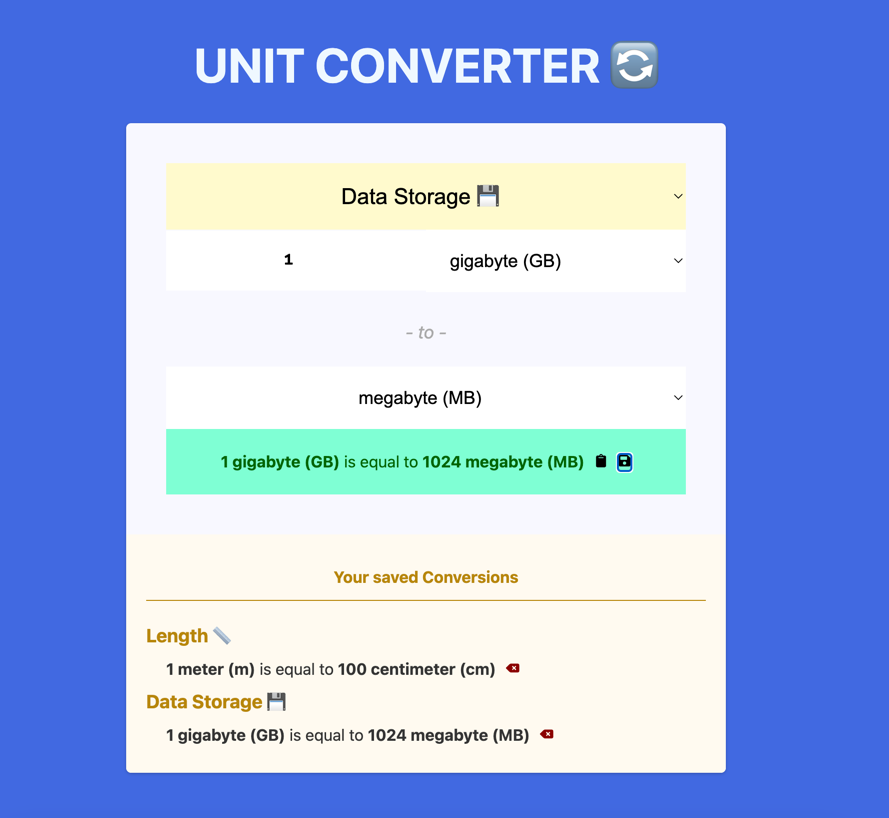

# Day 3: Unit Converter

**Note:** This repository is part of a personal project called [my-studies-journal](https://github.com/carloscsc/my-studies-journal). The goal is to organize the code, study materials, and personal projects I use daily. For more details, please visit the main page of the repository.


[[SEE IN ACTION]](https://my-study-journal.vercel.app/day3-unit-converter/dist/)



This project was created to develop a unit conversion application, similar to the one embedded in Google Search.

## Key Features

One of the primary goals was to ensure that when switching between measurement types or units, the form would dynamically and responsively update the options in each `select` field as well as the corresponding conversion value.

To achieve this, I utilized `useReducer` and `useEffect` for state management and handling state changes, avoiding potential pitfalls like "useState hell" and unnecessary re-renders.

Additionally, I implemented `useRef` to create unique references for the input fields, which made it easier to manage and maintain their integrity with each state change.

## Historical Data Feature

Although maintaining a history of conversions may not be essential in real-world scenarios, it provided a valuable opportunity to practice array manipulation and working with `localStorage`.

## Future Improvements

There are undoubtedly more efficient ways to build this application, and I am committed to continuing my studies to discover and implement them!

## Installation

1. First, clone the repository without checking out the files:

   ```sh
   git clone --no-checkout https://github.com/carloscsc/my-studies-journal.git
   ```

2. Enter the cloned repository:
   ```sh
   cd my-studies-journal
   ```
3. Next, enable sparse-checkout in the cloned repository:
   ```sh
   git sparse-checkout init --cone
   ```
4. Configure sparse-checkout to include only the folder for this project:
   ```sh
   git sparse-checkout set day3-unit-converter
   ```
5. Checkout the files of the configured subfolder:
   ```sh
   git checkout
   ```
6. After cloning the folders, navigate to the project folder:

   ```sh
   cd day3-unit-converter
   ```

   (**Note:** After these steps, GitHub will copy only the folder of this project. However, the original folder structure will be maintained. If you wish, you can copy just this folder `my-studies-journal` to another directory and ignore all other files downloaded outside this folder)

   You may also want to delete the [\_studies](./_studies) folder, as it is not part of the project and exists only for my references.

7. Install the dependencies
   ```sh
   npm install
   ```
8. Finally, run the project
   ```sh
   npm rum dev
   ```

## Things I studed for this project

Studies projects, drafts, etc.. are localized on [\_studies](./_studies) folder

### Courses

- [Learn JavaScript - Scrimba](https://v2.scrimba.com/learn-javascript-c0v)

### Tutorials

- [React Full Course for free ⚛️ (2024)](https://www.youtube.com/watch?v=CgkZ7MvWUAA&t=5905s&ab_channel=BroCode)
- [Adding ESLint and Prettier to a ViteJS React project](https://stackademic.com/blog/adding-eslint-and-prettier-to-a-vitejs-react-project)

### Docs

- [React.dev/Learn](https://react.dev/learn)
- [React.dev/Learn/Tutorial: Tic-Tac-Toe](https://react.dev/learn/tutorial-tic-tac-toe) (#see [Tic-Tac-Toe [repo]](./_studies/tic-tac-toe) | [[see in action]](https://my-study-journal.vercel.app/day3-unit-converter/_studies/tic-tac-toe/dist))
- [Typechecking With PropTypes](https://legacy.reactjs.org/docs/typechecking-with-proptypes.html)

## About the Dist Folder

In this project, the `dist` folder was included directly in the main `main` branch of the repository, which is generally not a good practice. Ideally, it should be separated into a dedicated production branch, and the `dist` folder should be ignored in the repository's `.gitignore` file. The reason for following this anti-pattern here is that this is a subfolder of a main repository hosted entirely on Vercel. This is the simplest way (that I know of for now) to deploy all the projects in the repository simultaneously without additional configuration. Since these projects are meant for learning and not production, the deployment doesn't need to be more sophisticated or technical. Keeping it simple is often the best approach. (in most cases)

## [Roadmap.sh](https://roadmap.sh/) Projects

I also submit this project to [Roadmap.sh Projects](https://roadmap.sh/projects/unit-converter) if you are interested
you can see other solution and projects there.
